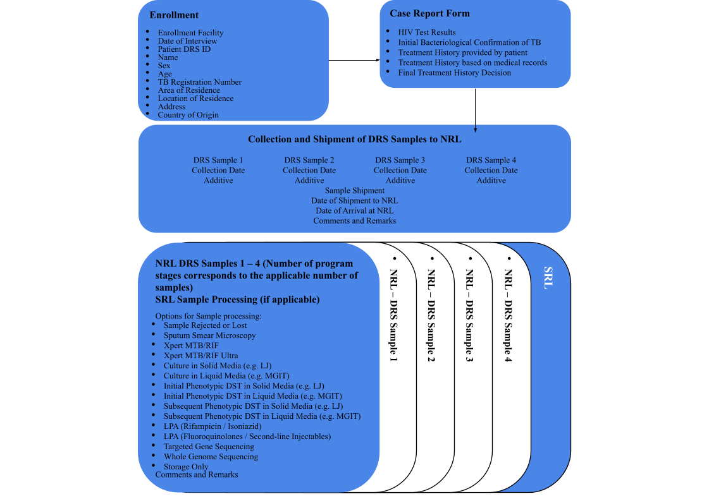
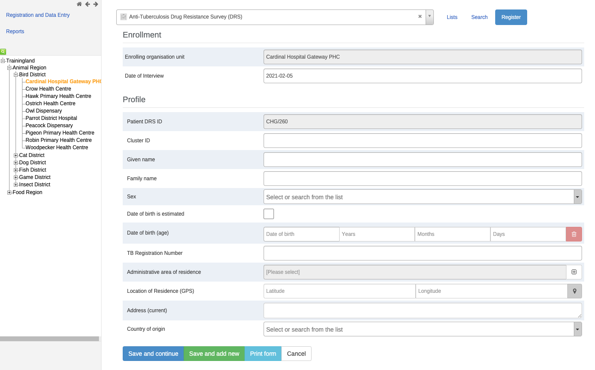
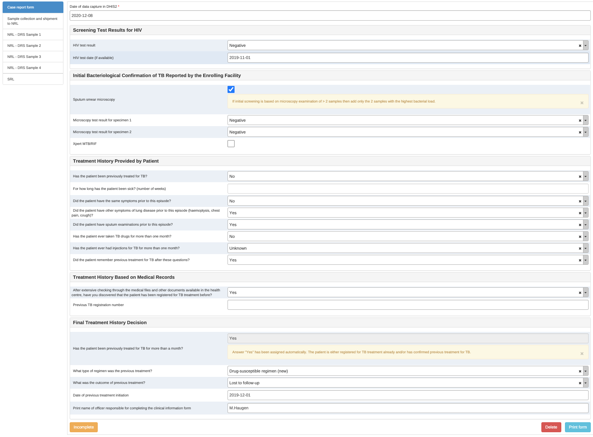
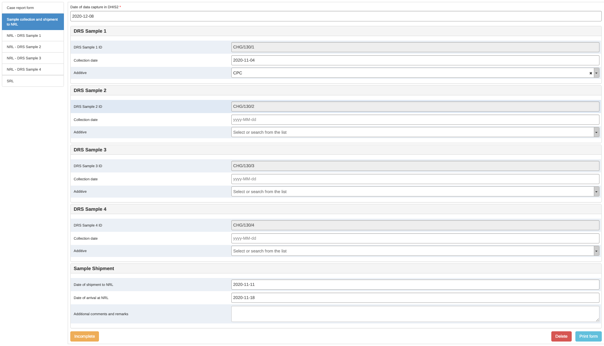
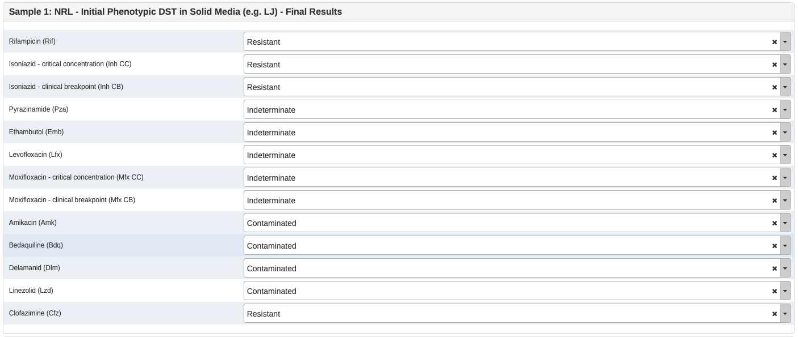
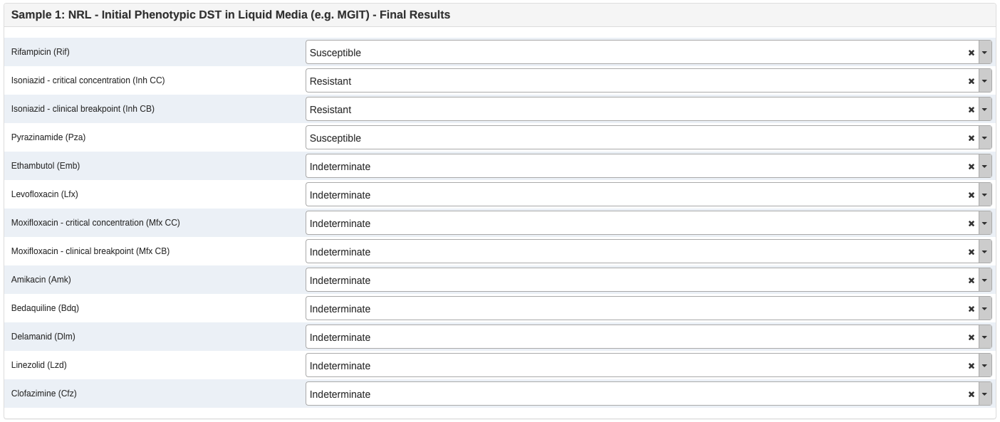
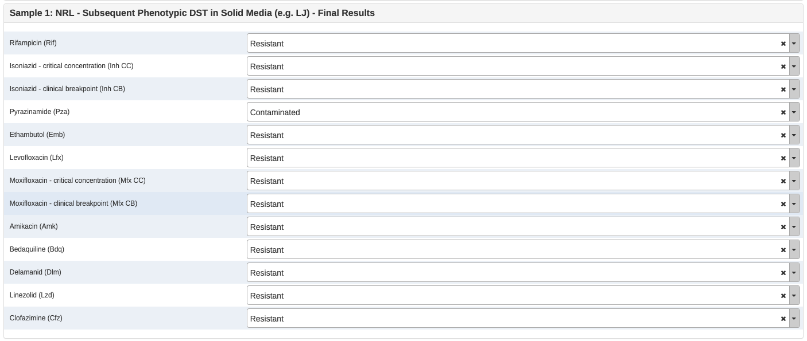
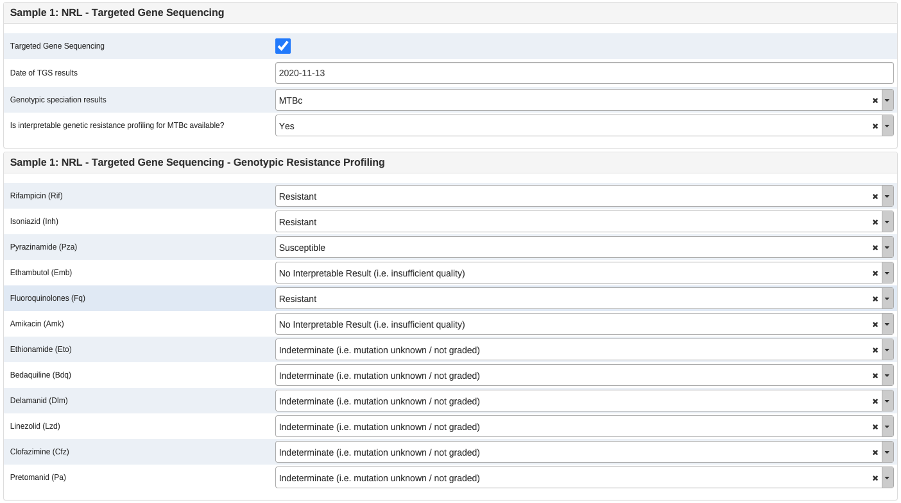
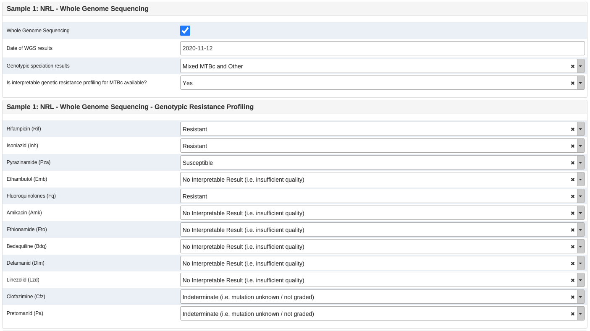
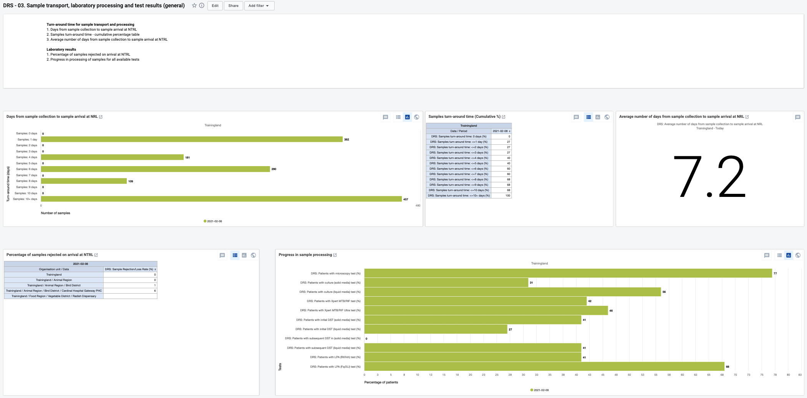

# WHO Anti-Tuberculosis Drugs Resistance Survey (DRS) - Tracker System Design

## Summary

The TB DRS Module in DHIS2 is a data collection tool designed specifically for anti-tuberculosis (TB) drug resistance surveys (DRS), which are discrete studies measuring drug resistance among a selected sample of individuals who are representative of an entire population with TB. Surveys are implemented periodically until capacity for a continuous routine surveillance system is established. The TB DRS module allows countries to fully configure the survey data capture tool, by specifying the study design and the laboratory algorithm used for identification and speciation of TB, and phenotypic and/or genotypic resistance profiling to anti-TB drugs. The module is designed for use by operational survey teams at central National Tuberculosis Programme (NTP) premises and/or at the National Reference Laboratory(ies) (NRL). Peripheral health care and diagnostic facilities partaking in the survey may directly input epidemiological and clinical questionnaire data from enrolled participants where applicable. Results from laboratory tests carried out overseas, often by an assigned Supranational TB Reference Laboratory (SRL) or another supporting partner, can also be directly entered in the system by the staff at SRL or imported by means of a csv file. The TB DRS Module is not intended for the clinical management of TB. The module allows export of standardised, analysis-ready, csv files and includes data visualisation dashboards, descriptive data summaries and cross-tabulations, and missing data reports to monitor the quality and progress of the survey.

## Purpose and Intended Audience

This document describes the conceptual design, content and functionality for a standard DHIS2 TB DRS Module for the electronic capture and visualisation of data from anti-TB drug resistance surveys (DRS). The module was designed based on the latest guidance and metadata requirements for the surveillance of drug resistance in TB. This document is intended for audiences responsible for implementing TB data systems and/or HMIS (Health Management Information Systems) in countries, as well as those specifically tasked with implementing a DRS as follows:

1. System admins/HMIS focal points: those responsible for installing metadata packages, designing and maintaining HMIS and/or TB data systems
2. Focal points from the DRS coordination and operational teams, comprising representatives of the National Tuberculosis Programme (NTP) and the National Reference Laboratory/ies (NRL), responsible for overseeing data collection, management, analysis and reporting functions for the survey
3. Implementation support specialists, e.g. those providing technical assistance to the TB programme or the core HMIS unit to support and maintain DHIS2 and its associated modules, such as the HISP groups.

The system design document explains how the DHIS2 TB DRS Module was configured to meet the data entry and analysis requirements and support a typical workflow. The document does not include an exhaustive listing of all metadata captured. This document also does not consider the resources and infrastructure needed to implement such a system, such as servers, power, internet connections, backups, training and user support. More information on the TB programme technical aspects informing this system design is available in the [WHO publication on electronic recording and reporting for tuberculosis care and control](http://www.who.int/tb/publications/electronic_recording_reporting/en/).

## Background

The Global Project on Anti-TB Drug Resistance Surveillance, hosted by WHO, is the oldest and largest project for the surveillance of antimicrobial drug resistance in the world. Since its launch in 1994, data on drug resistance in TB have been systematically collected and analysed from 169 countries worldwide (data until 2019). The data are derived from either continuous surveillance systems based on routine drug susceptibility testing (DST) in at least 80% of patients with bacteriologically confirmed TB or periodic epidemiological surveys of representative samples of patients. The Global Project is supported by various technical partners and the WHO Supranational TB Reference Laboratory (SRL) Network, which currently comprises 32 laboratories. The Global Project has served as a common platform for country, regional and global level evaluation of the magnitude and trends in anti-TB drug resistance and has assisted countries in planning the scale-up of the management of drug-resistant TB by providing essential data on national burden and drug resistance patterns.
The three main categories used for global surveillance are rifampicin-resistant (RR) TB either with concurrent isoniazid resistance (MDR-TB) or without; isoniazid-resistant TB without concurrent rifampicin resistance (Hr-TB); and additional resistance to fluoroquinolones among these groups, which form a critical component of the recommended treatment regimens for both MDR/RR-TB and Hr-TB. Revised definitions for pre-extensively drug-resistant (pre-XDR) TB and XDR-TB are being applied from 2021. Pre-XDR-TB refers to combined resistance to rifampicin and a fluoroquinolone. XDR-TB refers to combined resistance to these drugs as well as resistance to at least one Group A drug recommended for the treatment of MDR/RR-TB (bedaquiline or linezolid).

There has been considerable progress in increasing the coverage of DST with the global expansion of rapid molecular tools, which have allowed an increasing number of countries to transition from a reliance on periodic surveys to the establishment of continuous surveillance systems based on routine DST. Despite this progress, one third of countries still rely on conducting periodic surveys for the surveillance of drug resistance in TB, 23 of which are in the WHO’s list of 40 high TB and/or high multidrug resistant (MDR)-TB burden countries for the period 2016–2020. Conducting surveys can build and strengthen overall laboratory capacity, sample transport and referral systems, and data management expertise. All of these aspects, as well as implementation of electronic data capture systems and data connectivity solutions, support countries in transitioning to continuous surveillance of drug-resistant TB. The latter leads to improved access to timely and appropriate treatment and care, and offers programmatic benefits including rapid detection of outbreaks, real-time monitoring of the effectiveness of interventions and an understanding of trends.

WHO’s "Guidance for ensuring good clinical and data management practices for national TB surveys" (2021) provides an overview of the processes and procedures for collecting, handling, cleaning, validating, analysing and storing survey records to produce high-quality survey data that are complete, reliable, timely, processed correctly, and with integrity preserved. To this end, all countries are encouraged to move towards establishing electronic systems. This document describes a fully customisable electronic data-capture tool for anti-TB DRS designed in agreement with standards and recommendations outlined in the WHO’s "Guidance for the surveillance of drug resistance in tuberculosis, 6th edition" (2021). The survey tool includes dashboards for visualisations and summaries of data, including quality and progress indicators, to facilitate the monitoring and supervision of survey activities. The user does not require expertise in database configuration and design. Implementation of this tool may help countries develop the data management skills required for the long-term implementation of electronic systems for routine surveillance of TB and drug-resistant TB.

## System Design Overview

### Use Case

The TB DRS module enables registration of TB cases enrolled in a survey, and subsequent electronic data capture and tracking of laboratory tests and drug susceptibility test (DST) results for specimens submitted from each TB case to the NRL, following initial bacteriological confirmation of TB at health facilities enrolling eligible cases. The module captures a minimum set of variables required for epidemiological analysis of survey data as recommended in WHO’s "Guidance for the surveillance of drug resistance in tuberculosis, 6th edition". These comprise clinical and socio-demographic information about the patient (including history of previous anti-TB treatment and optional additional information on potential risk factors for drug resistance in tuberculosis), laboratory tests conducted on each sample submitted for testing, and laboratory results to selected anti-TB drugs. The TB DRS module is not designed to support clinical management nor patient care. The module serves as an electronic registry and database typically supporting centralised electronic data capture at NTP and/or NRL central premises. Depending on the country’s infrastructure and resource availability, the module may be adapted to support decentralized electronic data capture at the health facility level. Parts of the module are also configured to allow data entry directly by the SRL and other external supporting partners.

The sampling strategy and the diagnostic algorithm of choice for an anti-TB DRS will vary depending on the country. A survey diagnostic algorithm often combines several phenotypic and/or molecular techniques for  DST of a range of drugs selected by the country. The TB DRS module currently considers the two most common survey designs (either exhaustive sampling of all health facilities in the country or cluster sampling) and all the WHO-recommended laboratory diagnostic techniques for DST. Users can adapt the TB DRS module to fit their needs by selecting the survey design and the laboratory tests applicable to their survey. This includes configuration of the diagnostic test/s used at health facilities for the initial bacteriological confirmation of TB, and configuration of the numbers of sputum samples submitted to the NRL for further testing. Configuration of mixed survey designs in cases of stratified sampling are also possible. The specific anti-TB drugs to be included are also fully customisable.

### Program Overview

The survey workflow begins by enrolling an individual at a peripheral health facility following bacteriological confirmation of pulmonary TB, which involves assigning a unique survey identifier (DRS ID) to the individual and completing a case report form by interviewing the patient and consulting clinical records. The case report form collects socio-demographic and clinical information about the case, including HIV status where applicable. This information is often collected on paper, along with the microscopy or Xpert MTB/RIF test results of the initial bacteriological confirmation of TB. At least one sputum sample is then collected from the TB case for later shipment to the NRL. Details of the shipment, such as dates of sampling and shipment, are also noted in relevant paper forms.

Samples are usually shipped straight to the NRL and/or other collaborating laboratories along with all paper forms that have been completed at the peripheral health facility. Designated data entry clerks at central NRL/NTP premises first register the survey TB case by entering the DRS ID in the electronic database along with basic case details. Once a case is registered, information from field paper forms, such as the case report form, may be entered at a later date. Upon receiving the samples, designated NRL staff register the specimens in the system by completing the shipment details, including date of sample arrival in addition to dates of sample collection and shipment noted in paper forms. As the NRL conducts the laboratory analysis of the samples, laboratory tests and results are also entered into the module. The laboratory tests and results may be entered directly in real-time by NRL staff, or entered into the system by NTP or NRL staff from laboratory registers.

The TB DRS module is designed so that countries can configure the number of sputum samples to be collected from each enrolled TB case (between 1 and 4). Samples are automatically assigned a unique ID which corresponds to the concatenation of the patient (DRS) ID plus a sample replicate number. For each of the samples pre-configured in the system, the TB DRS module produces a form that contains the complete pre-defined list of tests to be conducted at NRL, for a customised panel of anti-TB drugs. The user should then enter, for each laboratory test, a final test result that  corresponds to the specific sample tested (using the form of the sample which was used for testing). Interim results are not captured by the system at this stage . There is, however, the possibility that a test is conducted on more than one sample, such is the case for microscopy examination of sputum smears. The module is hence designed to track the laboratory history of each sample, beginning by specifying whether a sample was discarded or stored only, and allowing for the capture of free text comments. If samples are shipped to SRL, a form to collate shipment details as well as SRL results is created in the system, which can be completed at a later date.

In order to enter laboratory test results, it is a prerequisite that the TB case has been registered in the module by adding the DRS ID and basic registration details. Only then can the related samples be registered for electronic capture of laboratory tests and results. Once the TB case and the samples are registered, the case and sample data can be retrieved for editing and for adding additional information at a later date. Whilst the most common survey workflow has been described above, the module may be adapted for decentralised or centralised direct real-time data entry without use of paper-based data collection tools in countries with adequate capacity and resources.

| Stage | Description | Required Preconfiguration |
| --- | --- | --- |
| Enrollment |Enter socio-demographic data to enroll the patient in TB DRS Module | Patient DRS ID   Cluster ID (if applicable) |
| Case Report Form | HIV Status, initial bacteriological confirmation of TB, treatment history provided by patient, treatment history based on clinical records, final treatment history decision | Initial screening: Bacteriological confirmation of TB |
| Collection and Shipment of DRS Samples to NRL | Sample DRS IDs, collection dates, additives, shipment to NRL, arrival to NRL, comments | Number of DRS Samples sent to NRL (country specific) |
| NRL - DRS Sample 1 | Tests performed on Sample 1 at NRL. Captures tests, test results, dates and comments | Number of program stages (from 1 to 4) can be pre configured depending on the number of samples sent to NRL (country specific) |
| NRL - DRS Sample 2 | Tests performed on Sample 2 at NRL. Captures tests, test results, dates and comments | -//- |
| NRL - DRS Sample 3 | Tests performed on Sample 3 at NRL. Captures tests, test results, dates and comments | -//- |
| NRL - DRS Sample 4 | Tests performed on Sample 4 at NRL. Captures tests, test results, dates and comments | -//- |
| SRL | Sample shipment to SRL and tests performed. Captures tests, test results, dates and comments | Country specific. SRL Stage can be excluded from the list of program stages |

### Enrollment

### Case Report Form

Case Report Form design is based on the "Example Clinical Information Form" from the [WHO Guidelines for surveillance of drug resistance in tuberculosis, 6th edition](https://apps.who.int/iris/bitstream/handle/10665/174897/9789241549134_eng.pdf?sequence=1). It is set-up for both secondary data entry (based on a paper form) and direct data entry during live interview. It captures:

- Patient’s HIV status;
- Initial screening results: bacteriological confirmation of TB either by sputum smear microscopy, Xpert MTB/RIF, or both tests. Initial screening test/s is/are configured during initial setup in the Maintenance App. NB  If initial screening is based on microscopy examination of > 2 samples, only 2 samples with the highest bacterial load are entered.;
- Treatment history provided by patient (if the patient does not remember earlier TB treatment, control questions are asked);
- Treatment history based on medical records;
- Final treatment history decision;
- Name of the officer responsible for completing the form.

Key data is displayed in the top bar of the DHIS2 DR-TB Case-based Surveillance Tracker Capture Interface.
If the patient is already enrolled in the DR-TB Case Surveillance Tracker, relevant data such as TB Registration Number may be automatically imported into the TB DRS Module.

### Collection and Shipment of DRS Samples to NRL

The number of samples shipped to the NRL is defined in the initial configuration. It may vary from 1 to 4 (see Initial Configuration: Constants). The program is designed to collect data about all shipped samples. Data for each sample is entered in the corresponding program stage. The Collection and Shipment Form captures collection dates for samples, any additives, date of sample shipment to NRL, date of arrival and any related comments and remarks.

Additive options: none; CPC; Ethanol; PrimeStore; Other. Option "Other" has to be specified in a separate field. DRS Sample IDs are generated according to the following standard: Patient DRS ID / [Sample Nr] Sample numbers are 1,2,3 or 4.

Optional functionality: When the module is used for direct data entry, notifications can be sent to NRLs in case data capture in the form DRS Sample Processing at NRL is taking place at NRLs. (to be configured separately).

### NRL – DRS Samples 1 - 4

The program stages for sample processing at NRL for samples 1-4 are identical. Each stage is intended to capture data for the corresponding sample.

The number of program stages shown in the TB DRS module is dependent on the number of samples that are sent to the NRL for processing and are set up in the Maintenance App during initial configuration of the program. Default configuration is 2 Samples.

NRL – DRS Sample 1 – 4 Program Stages are used to capture key data related to sample processing: tests used, dates and outcomes.

Each country uses different tests at the NRL level. TB DRS module includes the following tests:

- Sputum smear microscopy
- Xpert MTB/RIF
- Xpert MTB/RIF Ultra
- Culture in solid media (e.g. LJ)
- Culture in liquid media (e.g. MGIT)
- Initial phenotypic DST in solid media (e.g. LJ)
- Initial phenotypic DST in liquid media (e.g. MGIT)
- Subsequent phenotypic DST in solid media (e.g. LJ)
- Subsequent phenotypic DST in liquid media (e.g. MGIT)
- LPA (Rifampicin/Isoniazid)
- LPA (Fluoroquinolones/Second-line Injectables)
- Targeted Gene Sequencing
- Whole Genome Sequencing

The tests used for sample processing by the country’s NRLs are selected in the Maintenance App during the initial configuration of the program.

In addition, the program captures whether the sample was rejected or lost or whether it was stored. Any important details not captured in the form may be entered in the Comments and Remarks section.

#### Sample Rejected or Lost

- If the sample is rejected or lost, reasons for rejection or loss have to be provided. Program stage may be completed.

#### Sputum Smear Microscopy

- Date and final microscopy result are captured. Final result options: Negative; scanty; +; ++; +++

#### Xpert MTB/RIF

- Date and final Xpert MTB/RIF result are captured. If MTB is detected, the quantitative result is captured.
- Final Xpert MTB/RIF options: MTB detected (Rifampicin susceptible); MTB detected (Rifampicin resistant); MTB Detected (Rifampicin indeterminate); MTB not detected; No result; Error; Invalid
- Quantitative result options: High; Medium; Low; Very low; Trace; Unknown

#### Xpert MTB/RIF Ultra

- Date and final Xpert MTB/RIF Ultra result are captured. If MTB is detected, the quantitative result is captured.
- Final Xpert MTB/RIF Ultra options: MTB detected (Rifampicin susceptible); MTB detected (Rifampicin resistant); MTB Detected (Rifampicin indeterminate); MTB not detected; No result; Error; Invalid
- Quantitative result options: High; Medium; Low; Very low; Trace; Unknown

#### Culture in Solid Media (e.g. LJ)

- Date of inoculation, final culture result and date of final result are captured.
- Final culture result options: MTB; NTM; No growth; Contaminated

#### Culture in Liquid Media (e.g. MGIT)

- Date of inoculation, final culture result and date of final result are captured.
- Final culture result options: MTB; NTM; No growth; Contaminated

#### Initial Phenotypic DST in Solid Media (e.g. LJ)

- Date of inoculation, date of final results and final results for tested drugs are captured.
- The list of drugs for testing is defined in the Maintenance App during the initial setup of the program.

- List of drugs available for testing: Rifampicin, Isoniazid CC, Isoniazid CB, Pyrazinamide, Ethambutol, Levofloxacin, Moxifloxacin CC, Moxifloxacin CB, Amikacin, Bedaquiline, Delamanid, Linezolid, Clofazimine
- Clofamizine and Pyrazinamide can only be tested using liquid media.
- CC stands for The WHO-recommended Critical Concentrations for Isoniazid and Moxifloxacin testing.
- CB stands for Clinical Breakpoint and corresponds to higher concentration testing for Isoniazid and Moxifloxacin only.
- Final result options: Susceptible; Resistant; Contaminated; Indeterminate

#### Initial Phenotypic DST in Liquid Media (e.g. MGIT)

- Date of inoculation, date of final results and final results for tested drugs are captured.
- The list of drugs for testing is defined in the Maintenance App during the initial setup of the program.

- List of drugs available for testing: Rifampicin, Isoniazid CC, Isoniazid CB, Pyrazinamide, Ethambutol, Levofloxacin, Moxifloxacin CC, Moxifloxacin CB, Amikacin, Bedaquiline, Delamanid, Linezolid, Clofazimine
- CC stands for the WHO-recommended Critical Concentrations for Isoniazid and Moxifloxacin testing.
- CB stands for Clinical Breakpoint and corresponds to higher concentration testing for Isoniazid and Moxifloxacin only.
- Final Result Options: Susceptible; Resistant; Contaminated; Indeterminate

#### Subsequent Phenotypic DST in Solid Media (e.g. LJ)

- Date of inoculation, date of final results and final results for tested drugs are captured.
- The list of drugs for testing is defined in the Maintenance App during the initial setup of the program.

- List of drugs available for testing: Rifampicin, Isoniazid CC, Isoniazid CB, Pyrazinamide, Ethambutol, Levofloxacin, Moxifloxacin CC, Moxifloxacin CB, Amikacin, Bedaquiline, Delamanid, Linezolid, Clofazimine
- Clofamizine and Pyrazinamide can only be tested using liquid media.
- CC stands for the WHO-recommended Critical Concentrations for Isoniazid and Moxifloxacin testing.
- CB stands for Clinical Breakpoint and corresponds to higher concentration testing for Isoniazid and Moxifloxacin only.
- Final Result Options: Susceptible; Resistant; Contaminated; Indeterminate

#### Subsequent Phenotypic DST in Liquid Media (e.g. MGIT)

- Date of inoculation, date of final results and final results for tested drugs are captured.
- The list of drugs for testing is defined in the Maintenance App during the initial setup of the program.

- List of drugs available for testing: Rifampicin, Isoniazid CC, Isoniazid CB, Pyrazinamide, Ethambutol, Levofloxacin, Moxifloxacin CC, Moxifloxacin CB, Amikacin, Bedaquiline, Delamanid, Linezolid, Clofazimine
- CC stands for the WHO-recommended Critical Concentrations for Isoniazid and Moxifloxacin testing.
- CB stands for Clinical Breakpoint and corresponds to higher concentration testing for Isoniazid and Moxifloxacin only.
- Final Result Options: Susceptible; Resistant; Contaminated; Indeterminate

#### LPA (Rifampicin / Isoniazid)

- Date of LPA, specimen type and final results for Rifampicin and Isoniazid (if MTBc is detected) are captured.
- Specimen Type Options: Sputum samples or sediments; MTB culture isolates
- Final Result Options: Susceptible; Resistant; Indeterminate

#### LPA (Fluoroquinolones / Second-line Injectables)

- Date of LPA, specimen type and final results for Fluoroquinolones, Kanamycin, Amikacin/Capreomycin and Ethambutol (if MTBc is detected) are captured.
- Ethambutol can be excluded from the form during initial setup.
- Specimen Type Options: Sputum samples or sediments; MTB culture isolates
- Final Result Options: Susceptible; Resistant; Indeterminate

#### Targeted Gene Sequencing

- Date of results, genotypic speciation results and genotypic resistance profiling for tested drugs (if MTB complex (MTBc) was detected and interpretable genetic resistance profiling is available) are captured.
- Genotypic Speciation Results: MTBc; Mixed MTBc and Other; NTM; Contamination; Failed
- In case "Failed" is selected, reasons for failure have to be provided.
- List of drugs available for Genotypic Resistance Profiling: Rifampicin, Isoniazid, Pyrazinamide, Ethambutol, Fluoroquinolones, Amikacin, Ethionamide, Bedaquiline, Delamanid, Linezolid, Clofazimine, Pretomanid
- Final Result Options: Resistant; Susceptible; No Interpretable Result (i.e. insufficient quality); Indeterminate (i.e. mutation unknown / not graded)

#### Whole Genome Sequencing

- Date of results, genotypic speciation results and genotypic resistance profiling for tested drugs (if MTB complex (MTBc) was detected and interpretable genetic resistance profiling is available) are captured.
- Genotypic Speciation Results: MTBc; Mixed MTBc and Other; NTM; Contamination; Failed In case "Failed" is selected, reasons for failure have to be provided.
- List of drugs available for Genotypic Resistance Profiling: Rifampicin, Isoniazid, Pyrazinamide, Ethambutol, Fluoroquinolones, Amikacin, Ethionamide, Bedaquiline, Delamanid, Linezolid, Clofazimine, Pretomanid
- Final Result Options: Resistant; Susceptible; No Interpretable Result (i.e. insufficient quality); Indeterminate (i.e. mutation unknown / not graded)

#### Storage Only

- If the sample is stored, the "Storage Only" checkbox is selected. Program stage may be completed.

#### Comments and Remarks

#### SRL

This program stage can be added to Data Entry Forms if the samples are sent to an SRL lab during the survey.

## Initial Configuration

### Patient DRS ID

Data entry options for Patient DRS ID: For exhaustive sampling of all health facilities, Patient DRS ID is generated using a predefined 3-letter facility code and a serial number to identify the patient (formatted to 3 digits)

- CAD/001
- CAD/002
- Etc.

For Cluster sampling, Cluster ID, which is a separate Tracked Entity Attribute is added to the generated Patient DRS ID. The Attribute in the enrollments stage still consists of the Facility code and a serial number. All DRS Sample IDs are generated using a predefined 3-letter facility code, Cluster ID (formatted to 3 digits) and a serial number to identify the patient (formatted to 3 digits)

- CAD/002/001
- CAD/002/002
- Etc.

### Constants

TB DRS Module includes various features that allow countries to easily adopt its functionality and configure it using national standards and requirements. The initial configuration of constants allows such customization. The list of configurable settings and the manual is provided below:

#### Cluster Sampling / Exhaustive Sampling of all Health Facilities

Configure whether the country is using Cluster Sampling or Exhaustive Sampling of all Health Facilities

| Constant | Settings | UID |
|---|---|---|
| Cluster Sampling | Value "1" = Include Cluster Sampling for DRS.   Value "0" = Exclude Cluster Sampling from DRS. | aYPQMlxAZsz |

#### Number of DRS Samples sent to NRL

Configure the number of samples are sent to NRL processing

| Constant | Settings | UID |
|---|---|---|
| Sample 2 for NRL Processing | Value "1" = Add DRS Sample 2 collected for NRL processing to program configuration   Value "0" = Remove DRS Sample 2 from program configuration | rSS2dY6gwLJ |
| Sample 3 for NRL Processing | Value "1" = Add DRS Sample 3 collected for NRL processing to program configuration   Value "0" = Remove DRS Sample 3 from program configuration | sqgp1l0s4wp |
| Sample 4 for NRL Processing | Value "1" = Add DRS Sample 4 collected for NRL processing to program configuration   Value "0" = Remove DRS Sample 4 from program configuration | NXr7RH56Q1R |

#### Initial Screening Tests

Configure which initial screening tests are used for bacteriological confirmation of TB: **Sputum Smear Microscopy, Xpert MTB/RIF** or **both**.

| Constant | Settings | UID |
|---|---|---|
| Bacteriological Confirmation of TB | Value "1" = Include both "Sputum Smear Microscopy" and "Xpert MTB/RIF" for Bacteriological Confirmation of TB.   Value "2" = Include only "Sputum smear microscopy" for Bacteriological Confirmation of TB.   Value "3" = Include only "Xpert MTB/RIF" for Bacteriological Confirmation of TB. | gYj2CUoep4O |

#### SRL Sample Processing

Configure whether the country has an option of sending samples to SRL (supranational lab).

| Constant | Settings | UID |
|---|---|---|
| SRL | Value "1" = include an option of sending Samples to SRL   Value "0" = exclude an option of sending Samples to SRL | AUltNkQXzdm |

#### Tests at NRL

| Constant | Settings | UID |
|---|---|---|
| Sputum Smear Microscopy | Value "1" = include Sputum Smear Microscopy in the list of tests.   Value "0" = exclude Sputum Smear Microscopy from the list of tests. | q1ah12sKfG3 |
| Culture in Solid Media (e.g. LJ) | Value "1" = include Culture in Solid Media (e.g. LG) in the list of tests.   Value "0" = exclude Culture in Solid Media (e.g. LG) from the list of tests. | iSKEqcuVAui |
| Culture in Liquid Media (e.g. MGIT) | Value "1" = include Culture in Liquid Media (e.g. MGIT) in the list of tests.   Value "0" = exclude Culture in Liquid Media (e.g. MGIT) from the list of tests. | qpAseG5vJyS |
| Xpert MTB/RIF | Value "1" = include Xpert MTB/RIF in the list of tests.   Value "0" = exclude Xpert MTB/RIF from the list of tests. | H4ObQDbhnTA |
| Xpert MTB/RIF Ultra | Value "1" = include Xpert MTB/RIF Ultra in the list of tests.   Value "0" = exclude Xpert MTB/RIF Ultra from the list of tests. | cFoFDkXKcXC |
| Initial Phenotypic DST in Solid Media (eg. LJ) | Value "1" = include Initial Phenotypic DST in Solid Media (eg. LJ) in the list of tests.   Value "0" = exclude Initial Phenotypic DST in Solid Media (eg. LJ) from the list of tests. | HjN2Bgnusyy |
| Initial Phenotypic DST in Liquid Media (eg. MGIT) | Value "1" = include Initial Phenotypic DST in Liquid Media (eg. MGIT) in the list of tests.   Value "0" = exclude Initial Phenotypic DST in Liquid Media (eg. MGIT) from the list of tests. | OQxeAIyQUeB |
| Subsequent Phenotypic DST in Solid Media (eg. LJ) | Value "1" = include Subsequent Phenotypic DST in Solid Media (eg. LJ) in the list of tests.   Value "0" = exclude Subsequent Phenotypic DST in Solid Media (eg. LJ) from the list of tests. | BpRfvWQcvTo |
| LPA (Rif/Inh) | Value "1" = include LPA (Rif/Inh) in the list of tests.   Value "0" = exclude LPA (Rif/Inh) from the list of tests. | ESUffSPwmju |
| LPA (Fq/2LI) | Value "1" = include LPA (Fq/2LI) in the list of tests.   Value "0" = exclude LPA (Fq/2LI) from the list of tests. | govArZqiFzY |
| Subsequent Phenotypic DST in Liquid Media (eg. MGIT) | Value "1" = include Subsequent Phenotypic DST in Liquid Media (eg. MGIT) in the list of tests.   Value "0" = exclude Subsequent Phenotypic DST in Liquid Media (eg. MGIT) from the list of tests. | W8Fm1pJuJPL |
| Targeted Gene Sequencing | Value "1" = include Targeted Gene Sequencing in the list of tests.   Value "0" = exclude Targeted Gene Sequencing from the list of tests. | KkypNdLNW1f |
| Whole Genome Sequencing | Value "1" = include WGS in the list of tests.   Value "0" = exclude WGS from the list of tests. | MC7QUDr9YKC |

#### List of Available Drugs

| Initial Phenotypic DST in Solid Media (eg. LJ) |||
|---|---|---|
| Constant | Settings | UID |
| Initial Phenotypic DST in Solid Media - Rifampicin | Value "1" = include Rifampicin in the list of drugs available for Initial Phenotypic DST testing in solid media.   Value "0" = exclude Rifampicin from the list of drugs available for Initial Phenotypic DST testing in solid media. | Q67DDsupq7v |
| Initial Phenotypic DST in Solid Media - Isoniazid (CC) | Value "1" = include Isoniazid (CC) in the list of drugs available for Initial Phenotypic DST testing in solid media.   Value "0" = exclude Isoniazid (CC) from the list of drugs available for Initial Phenotypic DST testing in solid media. | dAPAScvFPfX |
| Initial Phenotypic DST in Solid Media - Isoniazid (CB) | Value "1" = include Isoniazid (CB) in the list of drugs available for Initial Phenotypic DST testing in solid media.   Value "0" = exclude Isoniazid (CB) from the list of drugs available for Initial Phenotypic DST testing in solid media. | anpSc1tmlft |
| Initial Phenotypic DST in Solid Media - Pyrazinamide | Value "1" = include Pyrazinamide in the list of drugs available for Initial Phenotypic DST testing in solid media.   Value "0" = exclude Pyrazinamide from the list of drugs available for Initial Phenotypic DST testing in solid media.   Pyrazinamide can only be tested using liquid media. | aCaNdqUIDZl |
| Initial Phenotypic DST in Solid Media - Ethambutol | Value "1" = include Ethambutol in the list of drugs available for Initial Phenotypic DST testing in solid media.   Value "0" = exclude Ethambutol from the list of drugs available for Initial Phenotypic DST testing in solid media. | yxPHZFwMTN6 |
| Initial Phenotypic DST in Solid Media - Levofloxacin | Value "1" = include Levofloxacin in the list of drugs available for Initial Phenotypic DST testing in solid media.   Value "0" = exclude Levofloxacin from the list of drugs available for Initial Phenotypic DST testing in solid media. | NlOX3oV4gWe |
| Initial Phenotypic DST in Solid Media - Moxifloxacin (CC) | Value "1" = include Moxifloxacin (CC) in the list of drugs available for Initial Phenotypic DST testing in solid media.   Value "0" = exclude Moxifloxacin (CC) from the list of drugs available for Initial Phenotypic DST testing in solid media. | RJNE1o9cw7Y |
| Initial Phenotypic DST in Solid Media - Moxifloxacin (CB) | Value "1" = include Moxifloxacin (CB) in the list of drugs available for Initial Phenotypic DST testing in solid media.   Value "0" = exclude Moxifloxacin (CB) from the list of drugs available for Initial Phenotypic DST testing in solid media. | m4c79OHEKCG |
| Initial Phenotypic DST in Solid Media - Amikacin | Value "1" = include Amikacin in the list of drugs available for Initial Phenotypic DST testing in solid media.   Value "0" = exclude Amikacin from the list of drugs available for Initial Phenotypic DST testing in solid media. | XO1V9o5C95J |
| Initial Phenotypic DST in Solid Media - Bedaquiline | Value "1" = include Bedaquiline in the list of drugs available for Initial Phenotypic DST testing in solid media.   Value "0" = exclude Bedaquiline from the list of drugs available for Initial Phenotypic DST testing in solid media. | UxcTzMRQsfa |
| Initial Phenotypic DST in Solid Media - Delamanid | Value "1" = include Delamanid in the list of drugs available for Initial Phenotypic DST testing in solid media.   Value "0" = exclude Delamanid from the list of drugs available for Initial Phenotypic DST testing in solid media. | VUlsMrm4D8k |
| Initial Phenotypic DST in Solid Media - Linezolid | Value "1" = include Linezolid in the list of drugs available for Initial Phenotypic DST testing in solid media.   Value "0" = exclude Linezolid from the list of drugs available for Initial Phenotypic DST testing in solid media. | CVQR2ZtZWxk |
| Initial Phenotypic DST in Solid Media - Clofazimine | Value "1" = include Clofazimine in the list of drugs available for Initial Phenotypic DST testing in solid media.   Value "0" = exclude Clofazimine from the list of drugs available for Initial Phenotypic DST testing in solid media.   Clofazimine can only be tested using liquid media. | ZDpLleSK08x |

| Initial Phenotypic DST in Liquid Media (eg. MGIT) |||
|---|---|---|
| Initial Phenotypic DST in Liquid Media - Rifampicin | Value "1" = include Rifampicin in the list of drugs available for Initial Phenotypic DST testing in liquid media.   Value "0" = exclude Rifampicin from the list of drugs available for Initial Phenotypic DST testing in liquid media. | uOJYEwV7XfN |
| Initial Phenotypic DST in Liquid Media - Isoniazid (CC) | Value "1" = include Isoniazid (CC) in the list of drugs available for Initial Phenotypic DST testing in liquid media.   Value "0" = exclude Isoniazid (CC) from the list of drugs available for Initial Phenotypic DST testing in liquid media. | cRldkiBh5xv |
| Initial Phenotypic DST in Liquid Media - Isoniazid (CB) | Value "1" = include Isoniazid (CB) in the list of drugs available for Initial Phenotypic DST testing in liquid media.   Value "0" = exclude Isoniazid (CB) from the list of drugs available for Initial Phenotypic DST testing in liquid media. | lqaf0KfpHGd |
| Initial Phenotypic DST in Liquid Media - Pyrazinamide | Value "1" = include Pyrazinamide in the list of drugs available for Initial Phenotypic DST testing in liquid media.   Value "0" = exclude Pyrazinamide from the list of drugs available for Initial Phenotypic DST testing in liquid media. | FDtk4otxDse |
| Initial Phenotypic DST in Liquid Media - Ethambutol | Value "1" = include Ethambutol in the list of drugs available for Initial Phenotypic DST testing in liquid media.   Value "0" = exclude Ethambutol from the list of drugs available for Initial Phenotypic DST testing in liquid media. | n9zOOsLO0QP |
| Initial Phenotypic DST in Liquid Media - Levofloxacin | Value "1" = include Levofloxacin in the list of drugs available for Initial Phenotypic DST testing in liquid media.   Value "0" = exclude Levofloxacin from the list of drugs available for Initial Phenotypic DST testing in liquid media. | t7Okdm8VgDV |
| Initial Phenotypic DST in Liquid Media - Moxifloxacin (CC) | Value "1" = include Moxifloxacin (CC) in the list of drugs available for Initial Phenotypic DST testing in liquid media.   Value "0" = exclude Moxifloxacin (CC) from the list of drugs available for Initial Phenotypic DST testing in liquid media. | dgjpdQO2Iva |
| Initial Phenotypic DST in Liquid Media - Moxifloxacin (CB) | Value "1" = include Moxifloxacin (CB) in the list of drugs available for Initial Phenotypic DST testing in liquid media.   Value "0" = exclude Moxifloxacin (CB) from the list of drugs available for Initial Phenotypic DST testing in liquid media. | UL61U78GWCg |
| Initial Phenotypic DST in Liquid Media - Amikacin | Value "1" = include Amikacin in the list of drugs available for Initial Phenotypic DST testing in liquid media.   Value "0" = exclude Amikacin from the list of drugs available for Initial Phenotypic DST testing in liquid media. | x6v8O6EZo0U |
| Initial Phenotypic DST in Liquid Media - Bedaquiline | Value "1" = include Bedaquiline in the list of drugs available for Initial Phenotypic DST testing in liquid media.   Value "0" = exclude Bedaquiline from the list of drugs available for Initial Phenotypic DST testing in liquid media. | KjvwSybuWJU |
| Initial Phenotypic DST in Liquid Media - Delamanid | Value "1" = include Delamanid in the list of drugs available for Initial Phenotypic DST testing in liquid media.   Value "0" = exclude Delamanid from the list of drugs available for Initial Phenotypic DST testing in liquid media. | BJTzi3WWjhT |
| Initial Phenotypic DST in Liquid Media - Linezolid | Value "1" = include Linezolid in the list of drugs available for Initial Phenotypic DST testing in liquid media.   Value "0" = exclude Linezolid from the list of drugs available for Initial Phenotypic DST testing in liquid media. | aZq11UuXPP6 |
| Initial Phenotypic DST in Liquid Media - Clofazimine | Value "1" = include Clofazimine in the list of drugs available for Initial Phenotypic DST testing in liquid media.   Value "0" = exclude Clofazimine from the list of drugs available for Initial Phenotypic DST testing in liquid media. | GL5JTtBvbEC |

| Subsequent Phenotypic DST in Solid Media (eg. LJ) |||
|---|---|---|
| Constant | Settings | UID |
| Subsequent Phenotypic DST in Solid Media - Rifampicin | Value "1" = include Rifampicin in the list of drugs available for Subsequent Phenotypic DST testing in solid media.   Value "0" = exclude Rifampicin from the list of drugs available for Subsequent Phenotypic DST testing in solid media. | zJoEjvstp2d |
| Subsequent Phenotypic DST in Solid Media - Isoniazid (CC) | Value "1" = include Isoniazid (CC) in the list of drugs available for Subsequent Phenotypic DST testing in solid media.   Value "0" = exclude Isoniazid (CC) from the list of drugs available for Subsequent Phenotypic DST testing in solid media. | eM3UfUO7W8O |
| Subsequent Phenotypic DST in Solid Media - Isoniazid (CB) | Value "1" = include Isoniazid (CB) in the list of drugs available for Subsequent Phenotypic DST testing in solid media.   Value "0" = exclude Isoniazid (CB) from the list of drugs available for Subsequent Phenotypic DST testing in solid media. | s8WPR943gGS |
| Subsequent Phenotypic DST in Solid Media - Pyrazinamide | Value "1" = include Pyrazinamide in the list of drugs available for Subsequent Phenotypic DST testing in solid media.   Value "0" = exclude Pyrazinamide from the list of drugs available for Subsequent Phenotypic DST testing in solid media.   Pyrazinamide can only be tested using liquid media. | bHPYGfrFNV2 |
| Subsequent Phenotypic DST in Solid Media - Ethambutol | Value "1" = include Ethambutol in the list of drugs available for Subsequent Phenotypic DST testing in solid media.   Value "0" = exclude Ethambutol from the list of drugs available for Subsequent Phenotypic DST testing in solid media. | wNxsAieLWYc |
| Subsequent Phenotypic DST in Solid Media - Levofloxacin | Value "1" = include Levofloxacin in the list of drugs available for Subsequent Phenotypic DST testing in solid media.   Value "0" = exclude Levofloxacin from the list of drugs available for Subsequent Phenotypic DST testing in solid media. | Fw8wOlTETPt |
| Subsequent Phenotypic DST in Solid Media - Moxifloxacin (CC) | Value "1" = include Moxifloxacin (CC) in the list of drugs available for Subsequent Phenotypic DST testing in solid media.   Value "0" = exclude Moxifloxacin (CC) from the list of drugs available for Subsequent Phenotypic DST testing in solid media. | Czx5FuOqF9i |
| Subsequent Phenotypic DST in Solid Media - Moxifloxacin (CB) | Value "1" = include Moxifloxacin (CB) in the list of drugs available for Subsequent Phenotypic DST testing in solid media.   Value "0" = exclude Moxifloxacin (CB) from the list of drugs available for Subsequent Phenotypic DST testing in solid media. | NvA1K4hFJbc |
| Subsequent Phenotypic DST in Solid Media - Amikacin | Value "1" = include Amikacin in the list of drugs available for Subsequent Phenotypic DST testing in solid media.   Value "0" = exclude Amikacin from the list of drugs available for Subsequent Phenotypic DST testing in solid media. | dTwKm1u2VhY |
| Subsequent Phenotypic DST in Solid Media - Bedaquiline | Value "1" = include Bedaquiline in the list of drugs available for Subsequent Phenotypic DST testing in solid media.   Value "0" = exclude Bedaquiline from the list of drugs available for Subsequent Phenotypic DST testing in solid media. | r70ONQRhaHY |
| Subsequent Phenotypic DST in Solid Media - Delamanid | Value "1" = include Delamanid in the list of drugs available for Subsequent Phenotypic DST testing in solid media.   Value "0" = exclude Delamanid from the list of drugs available for Subsequent Phenotypic DST testing in solid media. | RFqmLP5W5di |
| Subsequent Phenotypic DST in Solid Media - Linezolid | Value "1" = include Linezolid in the list of drugs available for Subsequent Phenotypic DST testing in solid media.   Value "0" = exclude Linezolid from the list of drugs available for Subsequent Phenotypic DST testing in solid media. | KIeI2d8xalG |
| Subsequent Phenotypic DST in Solid Media - Clofazimine | Value "1" = include Clofazimine in the list of drugs available for Subsequent Phenotypic DST testing in solid media.   Value "0" = exclude Clofazimine from the list of drugs available for Subsequent Phenotypic DST testing in solid media.   Clofazimine can only be tested using liquid media. | bywBn5DxVdi |

| Subsequent Phenotypic DST in Liquid Media (eg. MGIT) |||
|---|---|---|
| Subsequent Phenotypic DST in Liquid Media - Rifampicin | Value "1" = include Rifampicin in the list of drugs available for Subsequent Phenotypic DST testing in liquid media.   Value "0" = exclude Rifampicin from the list of drugs available for Subsequent Phenotypic DST testing in liquid media. | lelJEADYpeI |
| Subsequent Phenotypic DST in Liquid Media - Isoniazid (CC) | Value "1" = include Isoniazid (CC) in the list of drugs available for Subsequent Phenotypic DST testing in liquid media.   Value "0" = exclude Isoniazid (CC) from the list of drugs available for Subsequent Phenotypic DST testing in liquid media. | ZBpqH7xJLBO |
| Subsequent Phenotypic DST in Liquid Media - Isoniazid (CB) | Value "1" = include Isoniazid (CB) in the list of drugs available for Subsequent Phenotypic DST testing in liquid media.   Value "0" = exclude Isoniazid (CB) from the list of drugs available for Subsequent Phenotypic DST testing in liquid media. | F9DTb5zl8rS |
| Subsequent Phenotypic DST in Liquid Media - Pyrazinamide | Value "1" = include Pyrazinamide in the list of drugs available for Subsequent Phenotypic DST testing in liquid media.   Value "0" = exclude Pyrazinamide from the list of drugs available for Subsequent Phenotypic DST testing in liquid media. | VY15auehssY |
| Subsequent Phenotypic DST in Liquid Media - Ethambutol | Value "1" = include Ethambutol in the list of drugs available for Subsequent Phenotypic DST testing in liquid media.   Value "0" = exclude Ethambutol from the list of drugs available for Subsequent Phenotypic DST testing in liquid media. | Ic5asMdbpH8 |
| Subsequent Phenotypic DST in Liquid Media - Levofloxacin | Value "1" = include Levofloxacin in the list of drugs available for Subsequent Phenotypic DST testing in liquid media.   Value "0" = exclude Levofloxacin from the list of drugs available for Subsequent Phenotypic DST testing in liquid media. | b1KgVOel21P |
| Subsequent Phenotypic DST in Liquid Media - Moxifloxacin (CC) | Value "1" = include Moxifloxacin (CC) in the list of drugs available for Subsequent Phenotypic DST testing in liquid media.   Value "0" = exclude Moxifloxacin (CC) from the list of drugs available for Subsequent Phenotypic DST testing in liquid media. | HhKitGif8RV |
| Subsequent Phenotypic DST in Liquid Media - Moxifloxacin (CB) | Value "1" = include Moxifloxacin (CB) in the list of drugs available for Subsequent Phenotypic DST testing in liquid media.   Value "0" = exclude Moxifloxacin (CB) from the list of drugs available for Subsequent Phenotypic DST testing in liquid media. | xfltmyqC3p0 |
| Subsequent Phenotypic DST in Liquid Media - Amikacin | Value "1" = include Amikacin in the list of drugs available for Subsequent Phenotypic DST testing in liquid media.   Value "0" = exclude Amikacin from the list of drugs available for Subsequent Phenotypic DST testing in liquid media. | a4PpEfSutcV |
| Subsequent Phenotypic DST in Liquid Media - Bedaquiline | Value "1" = include Bedaquiline in the list of drugs available for Subsequent Phenotypic DST testing in liquid media.   Value "0" = exclude Bedaquiline from the list of drugs available for Subsequent Phenotypic DST testing in liquid media. | QaioqMbO0TX |
| Subsequent Phenotypic DST in Liquid Media - Delamanid | Value "1" = include Delamanid in the list of drugs available for Subsequent Phenotypic DST testing in liquid media.   Value "0" = exclude Delamanid from the list of drugs available for Subsequent Phenotypic DST testing in liquid media. | Xt5GU9kBD7q |
| Subsequent Phenotypic DST in Liquid Media - Linezolid | Value "1" = include Linezolid in the list of drugs available for Subsequent Phenotypic DST testing in liquid media.   Value "0" = exclude Linezolid from the list of drugs available for Subsequent Phenotypic DST testing in liquid media. | mU5iEABeF2K |
| Subsequent Phenotypic DST in Liquid Media - Clofazimine | Value "1" = include Clofazimine in the list of drugs available for Subsequent Phenotypic DST testing in liquid media.   Value "0" = exclude Clofazimine from the list of drugs available for Subsequent Phenotypic DST testing in liquid media. | Nb6oHqjCCZq |

| LPA (Fluoroquinolones / Second-line Injectables) |||
|---|---|---|
| LPA (Fq/2Li) - Ethambutol | Value "1" = include Ethambutol Result in LPA (Fq/2LI) Test.   Value "0" = exclude Ethambutol Result from LPA (Fq/2LI) Test. | AiyTLOJHMkl |

### Top Bar Widget

The top bar widget within the Tracker Capture app is useful for the data entry user to have a snapshot overview of information about the TEI (case) every time the TEI enrollment is opened for this program.

The table below summarizes program indicators and variables displayed in the Top Bar Widget and how they are calculated. "Type" refers to whether a particular variable is configured as a program indicator with the "display in form" option enabled, or if it is calculated and displayed using program rules.

| Variable | Type | Calculation |
|---|---|---|
| Current age (years) | Program indicator | Number of years between current date and the "Date of birth (age)" tracked entity attribute. |
| Treatment history | Program rule | History of previous treatment based on Case Report Form (New/Previously treated) |
| Resistance (Rif, Inh, Fq) | Program rule | Lists the drugs for which drug resistance have been detected and recorded in the NRL - DRS Samples 1-4 stages |

### Validation

The data entry forms contain several date validation checks. These include:

- Date of HIV status cannot be prior to Date of birth
- Date of previous treatment initiation cannot be prior to Date of birth
- Test result dates for Culture and DST cannot be prior to inoculation dates
- Test dates cannot precede sample collection dates
- Sample shipment date cannot precede sample collection date
- Sample arrival date cannot precede shipment date

Additional validation checks can be set up.

### Feedback Widget

The following feedback messages are configured to display in the Feedback Widget when certain conditions are met as outlined in the table below:

| Message | Condition |
|---|---|
| You entered a laboratory result before the date of sample collection. Laboratory result date must be on or after sample collection date. Please check both dates. | **Error:** Date of laboratory result precedes the date of sample collection |
| You entered a laboratory result before the date of inoculation. Laboratory result date must be on or after inoculation date. Please check both dates. | **Error:** Date of laboratory result precedes the date of inoculation |
| Answer "Yes" has been assigned automatically. The patient is either registered for TB treatment already and/or has confirmed previous treatment for TB. | **Warning:** The previous treatment history status is assgned automatically based on the answers in the Case Report Form |
| If initial screening is based on microscopy examination of > 2 samples then add only the 2 samples with the highest bacterial load. | **Warning:** User can only add screening data from two samples only |

### Analytics and Indicators

This section describes dashboards and analytics that have been configured for an analytics user.

The package comes with the following set of indicators and dashboards:

- DRS - 01. Enrollment
  - Cumulative enrollment data and enrollment data for the last 12 months
    - Total enrolled patients
    - Enrolled new patients
    - Enrolled previously treated patients
    - Enrolled patients with unknown treatment history
    - Enrolled patients by facility
- DRS - 02. Missing data report:
  - Missing data report showing, out of all enrolled patients, how many are missing results for final treatment history classification, age, gender and HIV
  - Missing data line list
- DRS - 03. Sample transport, laboratory processing and test results (general)
  - Turn-around time for sample transport and processing
    - Days from sample collection to sample arrival at NTRL
    - Samples turn-around time - cumulative percentage table
    - Average number of days from sample collection to sample arrival at NTRL
  - Laboratory results
    - Percentage of samples rejected on arrival at NTRL
    - Progress in processing of samples for all available tests
- DRS - 04. Microscopy
  - Samples and patients with microscopy result
  - Microscopy results per patient
- DRS - 05. Xpert MTB/RIF
  - Turn-around time for sample processing
  - Samples and patients tested with Xpert MTB/RIF
  - Patients with multiple samples tested by Xpert MTB/RIF
  - Detection of MTB
  - Rifampicin resistance
  - Test results per sample
- DRS - 06. Xpert MTB/RIF Ultra
  - Turn-around time for sample processing
  - Samples and patients tested with Xpert MTB/RIF Ultra
  - Patients with multiple samples tested by Xpert MTB/RIF Ultra
  - Detection of MTB
  - Rifampicin resistance
  - Test results per sample
- DRS - 07. Culture in solid media (e.g. LJ)
  - Turn-around time for sample processing
  - Samples and patients tested
  - Patients with multiple samples tested by Culture in solid media
  - Test results per patient
  - Test results per sample
- DRS - 08. Culture in liquid media (e.g. MGIT)
  - Turn-around time for sample processing
  - Samples and patients tested
  - Patients with multiple samples tested by Culture in liquid media
  - Test results per patient
  - Test results per sample
- DRS - 09. Initial DST in solid media (e.g. LJ)
  - Samples and patients tested
  - Patients with multiple samples tested by Initial DST in solid media
  - Test results per patient
  - Test results per sample
- DRS - 10. Initial DST in liquid media (e.g. MGIT)
  - Samples and patients tested
  - Patients with multiple samples tested by Initial DST in liquid media
  - Test results per patient
  - Test results per sample
- DRS - 11. Subsequent DST in solid media (e.g. LJ)
  - Samples and patients tested
  - Patients with multiple samples tested by Subsequent DST in solid media
  - Test results per patient
  - Test results per sample
- DRS - 12. Subsequent DST in liquid media (e.g. MGIT)
  - Samples and patients tested
  - Patients with multiple samples tested by Subsequent DST in liquid media
  - Test results per patient
  - Test results per sample
- DRS - 13. LPA (Rif/Inh)
  - Turn-around time for sample processing
  - Samples and patients tested
  - Patients with multiple samples tested by LPA (Rif/Inh)
  - Detection of MTB
  - Test results per patient
  - Test results per sample
- DRS - 14. LPA (Fq/2LI)
  - Turn-around time for sample processing
  - Samples and patients tested
  - Patients with multiple samples tested by LPA (Fq/2LI)
  - Detection of MTB
  - Test results per patient
  - Test results per sample
- DRS - 15. Maps
  - RR-TB patients (by health facility)
  - Patients with isoniazid resistant and rifampicin susceptible TB (by health facility)
  - RR-TB patients resistant to Fq (by health facility)

If a country is not using certain tests from the list at NRLs, the corresponding dashboards can be removed.

## User Groups

The following user groups are included in the TB DRS Module:

- DRS - Admin: can edit/view metadata; no access to data [all program stages]
- DRS - Data capture: can view metadata, can capture data [all program stages]
- DRS - Access: can view metadata, can view data [all program stages]

## References

- Guidance for ensuring good clinical and data management practices for national TB surveys. Geneva: World Health Organization; 2021.
- Guidance for the surveillance of drug resistance in tuberculosis - Sixth edition. Geneva: World Health Organization; 2021.
